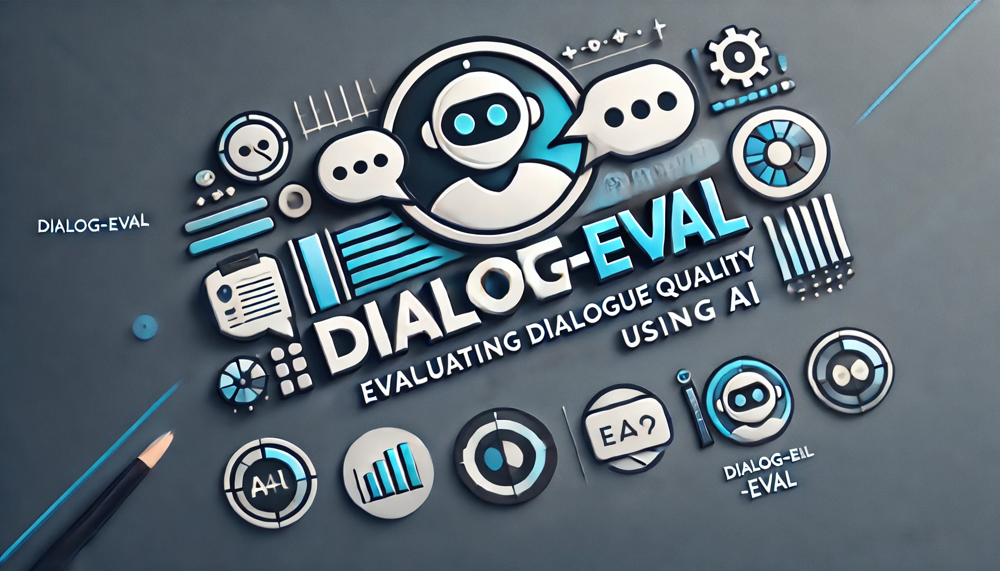

# GPTScore: Evaluating Generative Dialogue Responses




This is a modified codebase for calculating the GPTScore metric, as presented in the paper: [GPTScore: Evaluate as You Desire](https://arxiv.org/pdf/2302.04166.pdf).


## 1. What is GPTScore?

**GPTScore** is a novel evaluation framework that utilizes the emergent abilities (e.g., zero-shot instruction) of **G**enerative **P**re-**T**rained models to **Score** generated texts. 

It is an evaluation framework that leverages the emergent capabilities of large pre-trained language models to assess the quality of generated text in a customizable, and training-free manner. Unlike traditional methods requiring fine-tuning or fixed metrics, GPTScore uses natural language instructions and in-context learning to evaluate text across various aspects such as fluency, coherence, relevance, and informativeness.

The core idea is to calculate the conditional generation probability of a text given specific evaluation criteria, such as task descriptions and aspect definitions. This allows for flexible, user-defined evaluations that adapt to diverse scenarios. By using instruction-based models, GPTScore simplifies the evaluation process and aligns well with human judgments, making it suitable for tasks like dialogue evaluation, text summarization, and more.

## 2. Overview

**GPTScore_Dialogue** is a Python-based project designed to evaluate the **interest** of chatbot responses in a dialogue-response task. Using OpenAI's GPT models, the system computes scores based for two kind of dialogue: **TURN (Turn-Level)** and **DIALOGUE (Dialogue-Level)**. 

The project supports interactive chatbot conversations and allows users to calculate statistical correlations between GPT-based scores and human-annotated scores for better insight into the quality of chatbot responses.

---

## 3. Features
1. **Interactive Chatbot**:
   - Engage in live conversations with a chatbot.
   - Evaluate the responses in real-time using GPT models.

2. **Automated Evaluation**:
   - Compute scores using **dialogue** and **turn** evaluation methods:
     - **TURN (Turn Level)**: Evaluation conducted at the granularity of individual conversational turns, focusing on the quality of a single response in the context of its preceding input.
     - **DIALOGUE (Dialogue Level)**: Evaluation performed across the entire conversation, assessing the coherence, relevance, and overall quality of the interaction as a whole.
   - Focuses on the **overall quality** metric for chatbot responses, the task can be changed.
 
            
3. **Correlation Analysis**:
   - Compare GPTScore results with human-annotated scores.
   - Analyze statistical correlations to understand the relationship between machine and human evaluations.
   - Used: Spearman, Pearson and Kendall-Tau. 

## 4. Dataset
The main project uses a dialogue-response dataset structured as a JSON file, convai2_data.json. Each entry in the dataset contains:
- A `dialog_id` for unique identification.
- A list of conversational exchanges, including:
  - Message IDs.
  - Sender (e.g., `participant1`, `participant2`).
  - Text messages.

Example format:
```json
{
  "dialog_id": "12345abc",
  "dialog": [
    {"id": 0, "sender": "participant1", "text": "Hello! How are you?"},
    {"id": 1, "sender": "participant2", "text": "I'm good, thank you! And you?"}
  ],
  "eval_score": 1.0
}
```
Additional datasets utilized in this project include:

- Dsct9_data:  A specialized dataset focusing on domain-specific conversational turns, annotated with fine-grained quality metrics for response evaluation.
- Fed_data: Contains both turn-level and dialogue-level evaluated by human annotators for fluency, coherence, and informativeness. The overall metrics considered is the mean of all the scores. 
- Pc_usr and Tc_usr: Turn-level datasets containing conversational contexts paired with multiple responses generated by different models. Each response is scored across several dimensions, including Understandability, Naturalness, Maintenance of Context, and Engagement.


## 5. Installation 

1. Clone the repository:

```
git clone https://github.com/carmens0/GPTScore-dialog
cd GPTScore

```

2. Install dependencies:
- If using requirements.txt:

```
pip install -r requirements.txt

```

- If using Anaconda:
```
conda create --name gptscore_env --file requirements.txt
conda activate gptscore_env
```

### 5.1 Usage 

Run the project with:

```
python main.py

```

Choose an action:

1. Try a chatbot and evaluate:
  - Engage in a conversation with the chatbot and evaluate it using GPT models.

2. Train models for GPTScore:
  - Use a dataset to compute GPTScore for each dialogue.
  - Choose from available GPT models (gpt-4o, gpt-3.5, gpt-4o-mini, davinci-002).
  - Choose between turn-level and dialogue level evaluation. 

3. Calculate correlations:
  - Perform statistical analysis to evaluate the relationship between GPT-based scores (gpt_score) and human scores.

4. Exit


### 5.2 Example of worflow

1. Chatbot Interaction: 

Start chatting and save the dialogue for evaluation.
Example prompt:
```
User: Hello, how are you?
Chatbot: Hi! I'm great, thank you! How can I help you today?
```


2. Compute GPTScore:

Evaluate the saved conversation using GPT models for both VAL and IST methods.
The prompt design for the Turn-Level method is: 

```
prompt = (
            f"Answer the question based on the conversation between a human and AI.\nQuestion: Is the overall quality of the AI's most recent response satisfactory? (a) Yes. (b) No.\nConversation: {dialogue}\nAnswer: Yes."
        )
```

While the prompt design for Dialogue-Level method is: 
```
        prompt = (
            f"Answer the question based on the conversation between a human and AI.\nQuestion: Is the overall quality of the dialogue satisfactory? (a) Yes. (b) No.\nConversation: {dialogue}\nAnswer: Yes."
        )
```

Example of results: 

```
GPTScore Results:
Dialog 12345abc (gpt_score_gpt-3.5l): -0.35
Dialog 12345abc (gpt_score_gpt-3.5): -1.73
```

3. Correlation Analysis:

Compare GPTScore with human scores and generate a report:

Correlation Results:

```
Method: Spearman Correlation = 0.85, p-value = 0.02
Method: Pearson Correlation = 0.78, p-value = 0.12
```

## 6. Configuration
- API Key: Ensure you have an OpenAI API key to access GPT models.
- Models Supported: gpt-4o, gpt-3.5, gpt-4o-mini, davinci-002.


## 7. Results


| Dataset   | Level     | Model         | Spearman           |               | Pearson            |               | Kendall-Tau        |               |
|-----------|-----------|---------------|--------------------|---------------|--------------------|---------------|--------------------|---------------|
|           |           |               | Correlation        | P-value       | Correlation        | P-value       | Correlation        | P-value       |
| Convai_2  | Dialogue  | Gpt-4o-mini   | -0.08             | 0.002***      | -0.03             | 0.25          | -0.06             | 0.002***      |
| Convai_2  | Dialogue  | davinci-002   | 0.26              | 3.05e-23***   | 0.18              | 4.21e-12***   | 0.19              | 2.79e-23***   |
| DSCT9     | Dialogue  | davinci-002   | 0.10              | 6.63e-10***   | 0.10              | 5.64e-06***   | 0.07              | 6.11e-06***   |
| Fed       | Dialogue  | davinci-002   | 0.03              | 0.72          | 0.05              | 0.56          | 0.03              | 0.56          |
| Fed       | Turn      | davinci-002   | 0.20              | 9.42e-0.6***  | 0.20              | 9.12e-0.5***  | 0.14              | 8.60e-05***   |
| Pc-usr    | Turn      | davinci-002   | -0.11             | 0.016**       | -0.12             | 0.012**       | -0.10             | 0.012**       |
| Tc-usr    | Turn      | davinci-002   | -0.10             | 0.04*         | -0.10             | 0.05*         | -0.07             | 0.05*         |

**Note:** 
- `***` indicates significance at the 0.001 level.
- `**` indicates significance at the 0.01 level.
- `*` indicates significance at the 0.05 level.

## 8. Future Work
- Extend evaluation metrics to include other aspects like coherence or fluency.
- Support additional GPT models and evaluation methods.

## Author and contact 

| Name                | Description                                                                                       |
|---------------------|---------------------------------------------------------------------------------------------------|
| **Carmela Pia Senatore** | Developer - [carmens0](https://github.com/carmens0) <br> Email - [carmensenatore58@gmail.com](mailto:carmensenatore58@gmail.com) <br> LinkedIn - [Carmela Pia Senatore](https://linkedin.com/in/carmela-pia-senatore-ba1797207) |
| **Gennaro Capaldo**  | Developer - [gennaroc01](https://github.com/Gennaroc01) <br> Email - [gennaro.capaldo2001@gmail.com](mailto:gennaro.capaldo2001@gmail.com) <br> LinkedIn - []() |

## Contributing
Contributions are welcome! Please submit a pull request or raise an issue for any bugs or feature requests.
